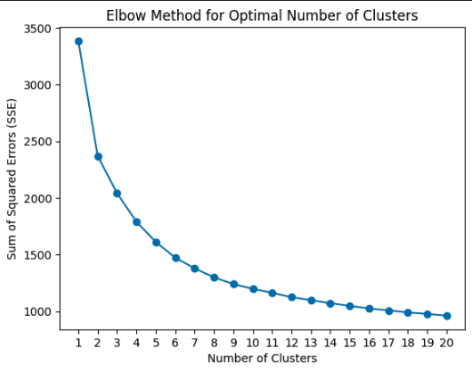

## Technical Overview of the FastAPI Application for Player Analysis

### Introduction

This FastAPI application analyzes and compares football players using a comprehensive dataset. It leverages various libraries, including a Generative AI model from Google, to provide an interactive web interface for exploring player statistics and similarities. The application generates radar charts and detailed player descriptions, enhancing the user experience with visual and textual insights.

### Data

The application initializes its database by uploading data from a CSV file during startup. This file contains detailed player statistics, which are essential for the analysis. The application ensures the database is refreshed with the latest data every time the application starts and  `asyncio.Lock()` guarantees exclusive access to the database during this process, preventing conflicts and ensuring data integrity.

### Player Listing and Submission

The application's main endpoint (`/`) displays a list of distinct player names from the database, which users can select and submit. The `get_players` function queries the database for unique player names and passes them to the template for rendering. The `submit_player` function then retrieves the selected player's data and finds similar players using a clustering algorithm.

### Finding Similar Players

The `find_similar_players` function is the core of the player comparison feature. It reads the entire dataset, normalizes specific performance metrics, and clusters players based on their positions and other attributes. The cosine similarity measure is used to rank these similar players, ensuring the most comparable players are presented to the user.

### Generating Radar Charts

The `generate_radar_charts` function creates radar charts for each similar player, visualizing their performance metrics. It selects relevant parameters based on the player's position and normalizes the statistics before generating the charts, which are saved as PNG files in the static directory. The radar charts display the statistics depending on the position of the player. For example, if the player is a forward, the radar chart displays statistics such as 'Expected xG', 'Standard Sh', 'Standard SoT%', 'Standard Sh/90', 'Aerial Duels Won%', 'Total Att', 'Total TotDist', and 'Total PrgDist'. However, if the player is a midfielder, the radar chart displays statistics such as 'Expected xA', 'Progression PrgC', 'KP', '1/3', 'PPA', 'CrsPA', 'Total Cmp%', and 'Total TotDist'.

### Detailed Player Descriptions

The application integrates with Google's Generative AI models to provide detailed player descriptions. The `fetch_gemini_results` function generates prompts based on selected player statistics and fetches the narrative responses, which are formatted as HTML using the markdown2 library.

### Endpoint for Viewing Descriptions

The `/view-description` endpoint allows users to request detailed descriptions for a selected player and a comparison player. It fetches the relevant data from the database and generates a descriptive narrative using the AI model, returning the response as JSON.

### Conclusion
This FastAPI application combines data analysis, Machine learning concepts and LLM tools to deliver a comprehensive platform for player analysis. It offers an interactive experience with visual aids and detailed textual insights, enhancing users' understanding of player performance and similarities.

## Machine Learning, Data Science and LLM overview

### Calculating Similar Players Through Cosine Similarity

Cosine similarity measures the simiarity between two non-zero vectors. It is given by the iner product space. The most common applications of cosine simiarity is text analysis, data mining, and machine learning where the simiarty of the documents are compared and represnted as vectors. However, we have used cosine similarity here to calculate the similairity between two players.

Cosine Similarity=cos(θ)=∥A∥∥B∥/(A⋅B)

Where:
A⋅B is the dot product of 
∥A∥ is the magnitude (or norm) of vector 
∥B∥ is the magnitude (or norm) of vector 

The cosine simiarity ranges from -1 to 1 where 1 indicates the vectors are identical, 0 indicates the verctors have no similarity and -1 indicates that the vectors are totally opposite.

Similarly, here we have calculated the cosine similarty of a group of players with the selected players and returned the top 10 players. 

Sure, here is the corrected version of your text with grammatical and stylistic improvements:

### Optimizing the Process through K-Means Clustering

K-means clustering is a popular unsupervised machine learning algorithm used to partition a dataset into K distinct, non-overlapping subgroups or clusters. It aims to minimize the variance within each cluster while maximizing the variance between different clusters. Here is how K-means clustering works:
1. Initially, we choose the number of clusters \( K \).
2. \( K \) centroids are chosen from the dataset.
3. Each data point is assigned to the nearest centroid.
4. New centroids are calculated as the mean of all data points assigned to each cluster.
5. Steps 3 and 4 are repeated until there is no change in the centroids or a maximum number of iterations is reached.
We use Euclidean distance to calculate the distance from a data point to the nearest cluster.
We chose 4 clusters by examining the elbow point in the figure below where the Silhouette Score (n=4) is 0.274574188555236.

​

Now, we have a labeled dataset. When a user chooses a player, our system will initially select a player from the clustered data, making it faster than selecting from the entire dataset. Thus, the user will be recommended 10 similar players to the one they chose.

### Using LLM to Generate Reports for the Recommended Player

We have used Google Gemini, a large language model developed by Google DeepMind. The prompts have been engineered in such a way that selected statistics (the columns) of the chosen player and the recommended players are passed into the prompt. However, the statistics passed depend on the position of the selected player. For example, if the player selected by the user is a defender, the defending stats such as 'Expected xG', 'Tackles Tkl', 'Tackles TklW', 'Tackles Def 3rd', 'Tackles Mid 3rd', 'Challenges Tkl%', 'Blocks Blocks', and 'Blocks Pass' are passed into the prompt. Conversely, if the player selected is a goalkeeper, then goalkeeping stats such as 'Performance GA', 'Performance SoTA', 'Performance Saves', 'Performance Save%', 'Performance CS', 'Performance CS%', 'Penalty Kicks PKatt', and 'Penalty Kicks Save%' are passed into the prompt.

The statistics of the selected player and the recommended players are then compared, and a short report is created to provide a textual comparison between them. This process is repeated for all 10 recommended players through a button in our system.

